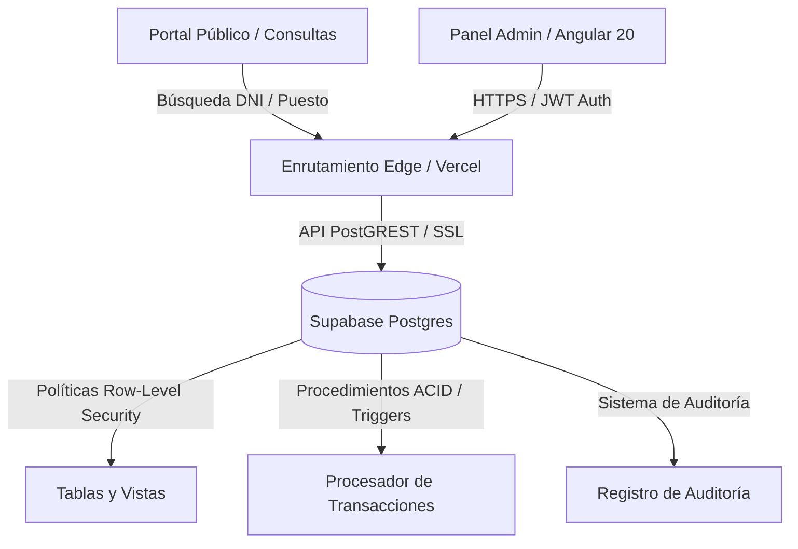

# Sistema Cooperativa Primero de Mayo

🌎 [English](README.md) · **Español**

Un sistema ERP y gestión financiera de grado empresarial diseñado para mercados municipales y asociaciones cooperativas para la gestión de locales comerciales, distribución de servicios básicos, cuentas de socios y control de cajas diarias.

[](https://sistema-cooperativa-ochre.vercel.app)
[](https://angular.dev)
[](https://supabase.com)
[](https://tailwindcss.com)

Una plataforma de gestión especializada diseñada para la Cooperativa del Mercado Primero de Mayo. Proporciona a las juntas administrativas y cajeros una herramienta segura, con cumplimiento ACID, para gestionar puestos comerciales, distribuir gastos de agua y luz comunitarios, facturar cuotas fijas de socios, y registrar cobranzas de efectivo y tarjeta con auditoría integrada.

---

## 🏗️ Vista General de la Arquitectura



---

## 🛠️ Stack Tecnológico

*   **Núcleo Frontend**: Angular 20 (Componentes Standalone, manejo de estado reactivo mediante Signals y carga diferida o Lazy Loading).
*   **Diseño y Estilos**: Tailwind CSS v4.0 (paletas armoniosas, tipografía Outfit, modo oscuro personalizado y layout TailAdmin).
*   **Base de Datos y Backend-as-a-Service**: Supabase Postgres v15+ (API PostGREST expuesta a través de autenticación JWT, Procedimientos Almacenados, Triggers y políticas de seguridad RLS).
*   **Librerías Clave**:
    *   `@supabase/supabase-js` - Conexión de datos en tiempo real y autenticación.
    *   `pdfmake` - Generación de recibos PDF e informes de alta calidad del lado del cliente.
    *   `apexcharts` & `ng-apexcharts` - Análisis financiero visual y métricas de cobranza.
    *   `xlsx` (SheetJS) - Migración procedimental de datos desde libros contables físicos en Excel.
    *   `flatpickr` - Selector ergonómico de fechas y periodos comerciales.

---

## 🚀 Características Clave

*   **Directorio de Doble Perspectiva:** Administra ocupaciones jerárquicas diferenciando entre espacios comerciales principales (puestos regulares/pequeños) y unidades de almacenamiento secundarias (almacenes) asignadas a socios, inquilinos o terceros.
*   **Distribución Detallada de Servicios:** Calcula la facturación mensual de agua y luz basada en lecturas de medidores físicos o prorrateo de tarifa plana, con controles instantáneos para suspender el cobro en puestos inactivos.
*   **Configuración de Cuentas de Socios:** Restringe los cargos corporativos corporativos (GA - *Gastos Administrativos* & PS - *Previsión Social*) exclusivamente a socios activos, con interruptores para suspender cobros de forma individual.
*   **Estado de Cuenta Unificado:** Realiza el seguimiento del ciclo de vida financiero de cada puesto bajo un libro de contabilidad de doble entrada, recalculando automáticamente saldos a favor al registrar abonos.
*   **POS de Doble Entrada y Procesamiento de Tarjetas:** Interfaz de punto de venta (*Caja Rápida*) para cajeros que soporta recibos con tarjeta de crédito (Visa/Mastercard), arqueo de caja diario, y aplicación automatizada de pagos mediante llamadas RPC transaccionales.
*   **Consulta Pública Enmascarada:** Un portal público seguro donde los usuarios pueden consultar deudas pendientes usando su DNI o número de puesto, con enmascaramiento de PII y mitigación de fuerza bruta.
*   **Sistema de Auditoría Activa:** Triggers automatizados en la base de datos que registran todas las modificaciones administrativas críticas (ajustes de tarifas, deudas manuales, anulaciones de pagos) en un historial de auditoría de solo lectura.

---

## ⚙️ Primeros Pasos

### Prerrequisitos
*   Node.js 18.x o 20.x (recomendado)
*   Angular CLI instalado de forma global:
    ```bash
    npm install -g @angular/cli
    ```

### 1. Clonar el Repositorio
```bash
git clone https://github.com/omparedes/SistemaCooperativa.git
cd SistemaCooperativa
```

### 2. Configurar Variables de Entorno
Crea un archivo `.env` en la carpeta raíz con tus credenciales de Supabase:
```ini
SUPABASE_URL=https://tu-proyecto.supabase.co
SUPABASE_ANON_KEY=tu-clave-anonima-publica
SUPABASE_SERVICE_ROLE_KEY=tu-clave-de-servicio-privada-nunca-exponer
```

### 3. Instalar Dependencias
```bash
npm install
```

### 4. Ejecución Local
Inicia el servidor de desarrollo:
```bash
npm start
```
Abre **[http://localhost:4200](http://localhost:4200)** en tu navegador.

---

## 📋 Variables de Entorno

| Nombre de Variable | Descripción | Requerida | Alcance / Seguridad |
| :--- | :--- | :---: | :--- |
| `SUPABASE_URL` | El endpoint REST API de tu cluster de Postgres en Supabase | **Sí** | Cliente y Servidor |
| `SUPABASE_ANON_KEY` | Clave pública anónima para realizar operaciones básicas de lectura/escritura bajo políticas RLS | **Sí** | Cliente y Servidor |
| `SUPABASE_SERVICE_ROLE_KEY` | Clave de administrador privada que evade las políticas RLS (usada SOLAMENTE en scripts de migración) | **Sí** | Solo Servidor (Secreto) |
| `SUPABASE_PROJECT_REF` | ID de referencia de tu proyecto remoto (usado por comandos CLI de Supabase) | No | Desarrollo / CLI |
| `SUPABASE_DB_PASSWORD` | Contraseña de base de datos para conexiones directas locales o remotas | No | Desarrollo / CLI |

---

## 📂 Estructura del Proyecto

```bash
SistemaCooperativa/
├── src/
│   ├── app/
│   │   ├── core/                  # Servicios de arquitectura singleton, guardias y modelos
│   │   │   ├── guards/            # Guardias de rutas (authGuard, adminGuard)
│   │   │   └── services/          # Servicios de conexión API (socios, giros, pagos, bancos)
│   │   ├── pages/                 # Componentes standalone de páginas mapeados a rutas diferidas
│   │   │   ├── socios/            # Gestión de perfiles de socios, inquilinos y ocupación
│   │   │   ├── giros/             # CRUD de categorías de actividad comercial
│   │   │   ├── pagos/             # Interfaces de cobranza rápida, POS y tarjetas
│   │   │   ├── facturacion/       # Distribución de gastos comunes de Luz y Agua
│   │   │   ├── cuenta-corriente/  # Estados de cuenta y movimientos detallados
│   │   │   ├── reportes/          # Analíticas visuales y cierre de caja diario
│   │   │   └── consultas/         # Portal seguro de consultas públicas
│   │   ├── shared/                # Layouts (app-layout, app-sidebar) y componentes comunes
│   │   └── app.routes.ts          # Registro central de enrutamiento con módulos Lazy Loaded
│   └── styles.css                 # CSS global con importaciones directas de Tailwind CSS v4
├── supabase/
│   ├── migrations/                # Migraciones de base de datos (Esquema Postgres, RLS, funciones)
│   └── config.toml                # Configuración del proyecto de Supabase
├── package.json                   # Definición de scripts y dependencias
└── README.md                      # Documentación del proyecto (Inglés)
```

---

## 🚧 Roadmap y Limitaciones Conocidas

*   **Almacenamiento Local de PDFs**: Los recibos de pago y reportes generados se compilan del lado del cliente utilizando `pdfmake`. El almacenamiento automático en Supabase Buckets con envío automatizado por correo se encuentra en desarrollo.
*   **Búfer Transaccional Offline**: Las transacciones de caja requieren conexión activa a Supabase. Se planea un almacenamiento temporal con IndexedDB para emitir recibos offline en caídas de internet para el Q3 2026.
*   **Conciliación Bancaria Automatizada**: La lectura de estados de cuenta bancarios (archivos `.txt` del BCP/BBVA) se procesa actualmente mediante mapeadores de archivos planos. Está pendiente la integración directa por API con las entidades bancarias.

---

## 📄 Licencia

Este proyecto es privado y propietario. Todos los derechos reservados. Desarrollado por **[Oscar Paredes](https://github.com/omparedes)**.

*   **LinkedIn**: [linkedin.com/in/omparedes](https://linkedin.com/in/omparedes)
*   **GitHub**: [@omparedes](https://github.com/omparedes)
