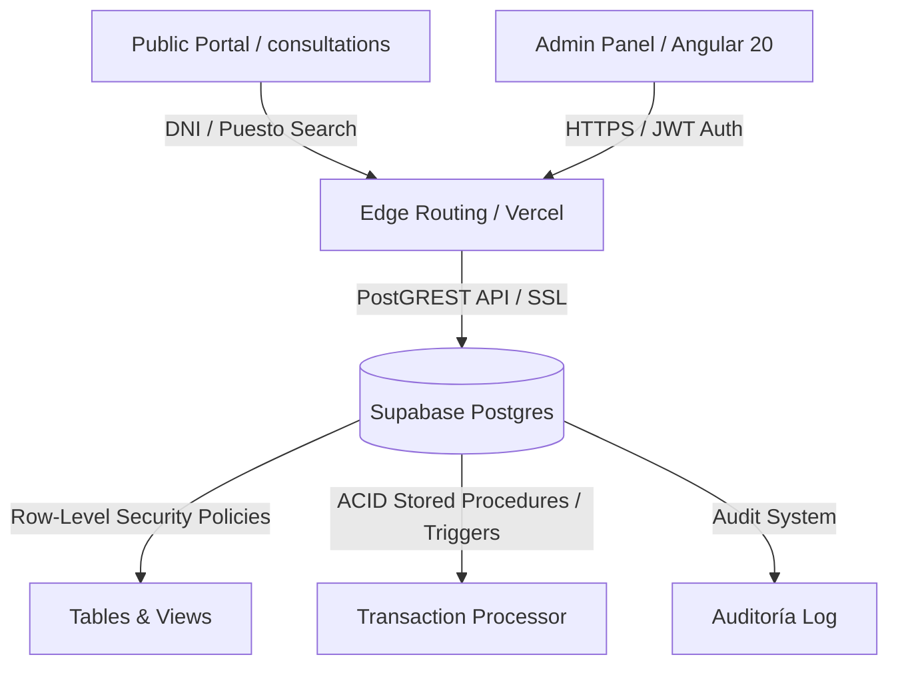

# Sistema Cooperativa Primero de Mayo

🌎 **English** · [Español](README.es.md)

An enterprise-grade ERP and financial management system built for municipal markets and cooperative associations to manage retail spaces, utilities distribution, membership accounts, and cash desks.

[](https://sistema-cooperativa-ochre.vercel.app)
[](https://angular.dev)
[](https://supabase.com)
[](https://tailwindcss.com)

A specialized management platform designed for the Primero de Mayo Cooperative Market. It provides administrative boards and cashiers with a secure, ACID-compliant tool to manage retail spaces, distribute communal water and electricity expenses, bill fixed membership fees, and record cash and card collections with audit trails. 

---

## 🏗️ Architecture & Flow Overview



---

## 🛠️ Tech Stack

*   **Frontend Core**: Angular 20 (Standalone Components, Reactive Signals state management, Lazy Loading routing).
*   **Styling & Design System**: Tailwind CSS v4.0 (harmonic palettes, Outfit typography, custom dark mode, custom TailAdmin layout).
*   **Database & Backend-as-a-Service**: Supabase Postgres v15+ (PostGREST API exposed via JWT authentication, Stored Procedures, Triggers, RLS policies).
*   **Libraries**:
    *   `@supabase/supabase-js` - Realtime data fetching and Auth.
    *   `pdfmake` - High-quality PDF receipt and report generation.
    *   `apexcharts` & `ng-apexcharts` - Visual financial analytics and collections metrics.
    *   `xlsx` (SheetJS) - Procedural data migration from physical ledgers.
    *   `flatpickr` - Ergonomic dates and periods selector.

---

## 🚀 Key Features

*   **Dual-Perspective Directory**: Manages hierarchical occupancies distinguishing between main commercial Spaces (Regular/Small stalls) and secondary storage Units (Almacenes) assigned to Partners, Tenants, or Third-parties.
*   **Granular Utility Distribution**: Calculates monthly Water and Electricity billing based on physical meter readings or flat-rate sharing, featuring toggles to instantly suspend billing on disabled stalls.
*   **Partnership Account Settings**: Restricts corporate fees (GA - *Gastos Administrativos* & PS - *Previsión Social*) exclusively to active Partners with toggle switches to suspend charges individually.
*   **Unified Account Statement**: Tracks the complete financial lifecycle of each stall under a double-entry ledger, automatically recalculating reactive balances (*Saldo a Favor*) on payments.
*   **Double-Entry POS & Card Processing**: POS interface (*Caja Rápida*) for cashiers supporting credit card receipts (Visa/Mastercard), daily cash desk balances (*Arqueo de Caja*), and automated payment applications via transactional RPCs.
*   **Masked Public Search**: A secure public portal where users can query pending debts using their DNI or Stall Number, with DNI masking and brute-force mitigation.
*   **Audit Trail System**: Automated database triggers that log all critical administrative edits (tariff adjustments, manual debt creation, voided payments) into a read-only audit ledger.

---

## ⚙️ Getting Started

### Prerequisites
*   Node.js 18.x or 20.x (recommended)
*   Angular CLI installed globally:
    ```bash
    npm install -g @angular/cli
    ```

### 1. Clone the Repository
```bash
git clone https://github.com/oscarparedes/SistemaCooperativa.git
cd SistemaCooperativa
```

### 2. Configure Environment Variables
Create a `.env` file in the root folder with your Supabase credentials:
```ini
SUPABASE_URL=https://your-project.supabase.co
SUPABASE_ANON_KEY=your-anon-public-key
SUPABASE_SERVICE_ROLE_KEY=your-service-role-key-never-expose
```

### 3. Install Dependencies
```bash
npm install
```

### 4. Run Locally
Start the development server:
```bash
npm start
```
Open **[http://localhost:4200](http://localhost:4200)** in your browser.

---

## 📋 Environment Variables

| Variable Name | Description | Required | Scope / Security |
| :--- | :--- | :---: | :--- |
| `SUPABASE_URL` | The REST API endpoint of your Supabase Postgres cluster | **Yes** | Client & Server |
| `SUPABASE_ANON_KEY` | Public anonymous key to perform basic read/write operations under RLS guards | **Yes** | Client & Server |
| `SUPABASE_SERVICE_ROLE_KEY` | Private admin key that bypasses RLS policies (used ONLY in migration and seed scripts) | **Yes** | Server-Only (Secret) |
| `SUPABASE_PROJECT_REF` | Ref ID of your remote project (used by Supabase CLI commands) | No | Development / CLI |
| `SUPABASE_DB_PASSWORD` | DB Password for local/remote database connections | No | Development / CLI |

---

## 📂 Project Structure

```bash
SistemaCooperativa/
├── src/
│   ├── app/
│   │   ├── core/                  # Singleton architecture services, guards, and models
│   │   │   ├── guards/            # Route guards (authGuard, adminGuard)
│   │   │   └── services/          # Services for API connection (socios, giros, pagos, bancos)
│   │   ├── pages/                 # Standalone page components mapped to lazy routes
│   │   │   ├── socios/            # Partners, Tenants and profiles management
│   │   │   ├── giros/             # Commercial activity categories CRUD
│   │   │   ├── pagos/             # Payment POS wizards, rapid cash, card collection
│   │   │   ├── facturacion/       # Communes expense sharing, Luz and Agua medidores
│   │   │   ├── cuenta-corriente/  # Account statements and ledgers
│   │   │   ├── reportes/          # Visual analytics and daily cashier desk closeout
│   │   │   └── consultas/         # Secure public search directory
│   │   ├── shared/                # Layouts (app-layout, app-sidebar) and components
│   │   └── app.routes.ts          # Central routing registry with Lazy Loaded chunks
│   └── styles.css                 # Global CSS importing Tailwind CSS v4 directives
├── supabase/
│   ├── migrations/                # Database migrations (Postgres Schema, RLS, functions)
│   └── config.toml                # Supabase project configuration
├── package.json                   # Dependencies and scripts definitions
└── README.md                      # Project documentation
```

---

## 🚧 Roadmap & Known Limitations

*   **Local PDF Storage**: Generated PDFs (payment receipts and closeout sheets) are compiled on the client side using `pdfmake`. Storage in Supabase Buckets with email delivery remains under development.
*   **Offline Transaction Buffer**: Cashier transactions require an active connection to Supabase. Temporary SQLite or IndexedDB storage for offline receipt issuance during internet drops is planned for Q3 2026.
*   **Bank Conciliation Automation**: Communal bank statement ingestion (`.txt` files from BCP/BBVA) is currently processed manually using flat-file mapping. An automated API integration with major banks is pending.

---

## 📄 License

This project is private and proprietary. All rights reserved. Developed by **[Oscar Paredes](https://github.com/oscarparedes)**.

*   **LinkedIn**: [linkedin.com/in/omparedes](https://linkedin.com/in/omparedes)
*   **GitHub**: [@oscarparedes](https://github.com/oscarparedes)
